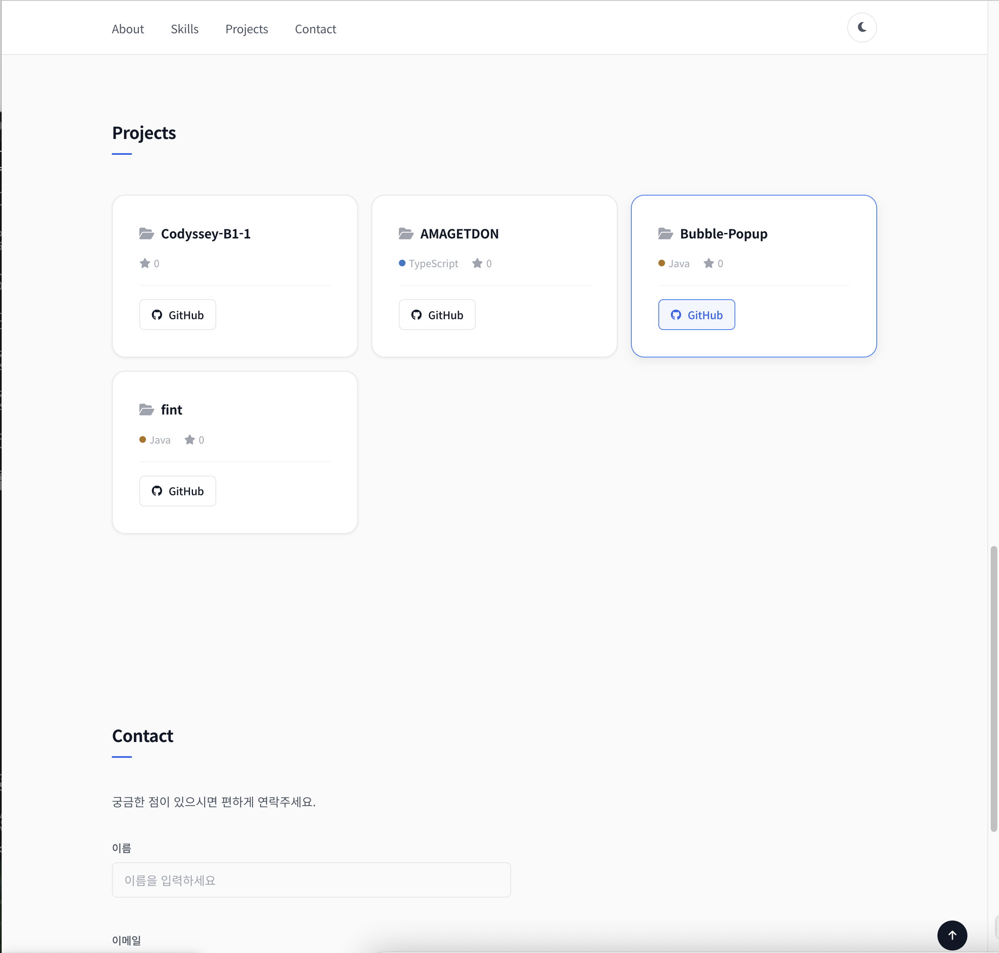
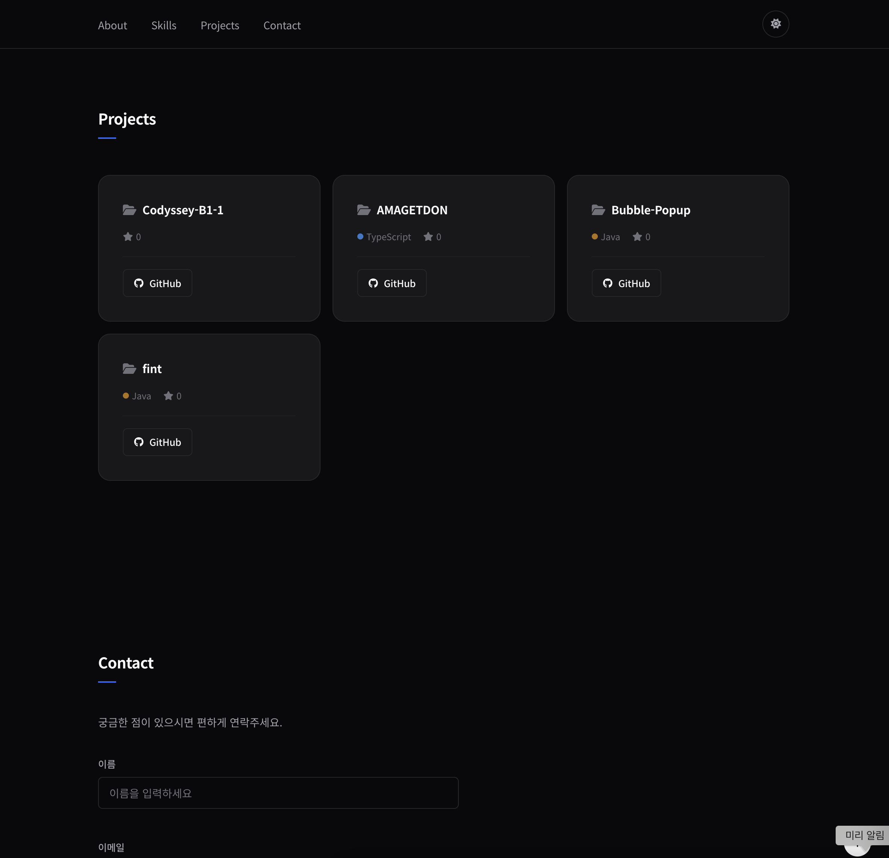
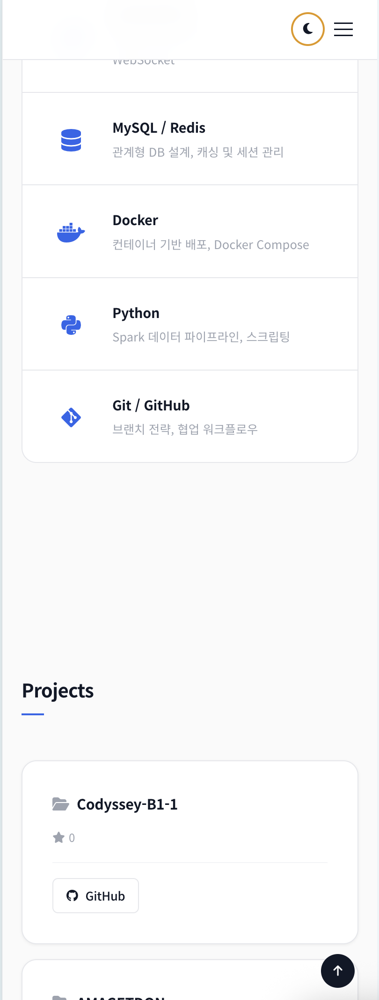

# Portfolio — 정은지

## 배포 URL

> https://unji09.github.io/portfolio/

## 미리보기

| Light Mode | Dark Mode |
|:---:|:---:|
|  |  |

| Mobile |
|:---:|
|  |

## 기술 스택

- **HTML5** — 시맨틱 태그 (`header`, `nav`, `main`, `section`, `article`, `footer`)
- **CSS3** — CSS 변수, Flexbox, Grid (`auto-fit`/`minmax`), 반응형
- **JavaScript (ES6+)** — `fetch`, `async/await`, Intersection Observer, `localStorage`

## 주요 기능

- **다크 모드** — 토글 버튼으로 전환, `localStorage`에 설정 저장
- **반응형 레이아웃** — 모바일 퍼스트 (`min-width: 768px`, `min-width: 1024px`)
- **햄버거 메뉴** — 모바일에서 슬라이드 아웃 네비게이션
- **GitHub API 연동** — `unji09` 계정의 레포지토리를 실시간으로 불러와 카드로 표시
  - 로딩, 성공, 에러, 빈 목록 4가지 상태 처리
- **폼 유효성 검사** — 실시간 입력 검증 + 제출 시 전체 검증
- **스크롤 애니메이션** — Intersection Observer (`threshold: 0.2`)로 fade-in
- **스크롤 탑 버튼** — 300px 이상 스크롤 시 표시
- **네비게이션 스크롤 효과** — 60px 이상 스크롤 시 헤더 배경 변경

## 구현 패턴

모든 인터랙션은 **이벤트 → 상태 변경 → DOM 업데이트** 패턴을 따릅니다.

```
사용자 클릭 → themeState.current 변경 → renderTheme() 호출
폼 입력     → formState 업데이트      → renderFormErrors() 호출
API 응답    → projectState 업데이트   → renderProjects() 호출
```

## 파일 구조

```
portfolio/
├── index.html          # 메인 페이지
├── css/
│   └── style.css       # 스타일시트 (변수, 레이아웃, 반응형)
├── js/
│   └── main.js         # 인터랙션 로직
├── images/             # 스크린샷 등 이미지
└── README.md
```
